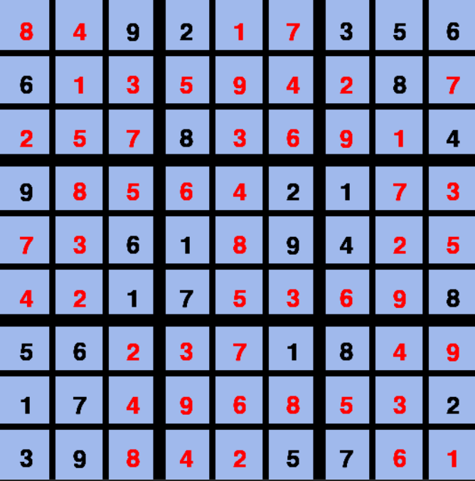

# Sudoku-solver-with-computer-vision

In this project, I built a program that gets an image that contains somewhere sudoku board,
and the sequence of numbers already on the board (from left to right and from top to bottom),
and outputs a graphical sudoku board with a solution. 

## For example:

  
   

